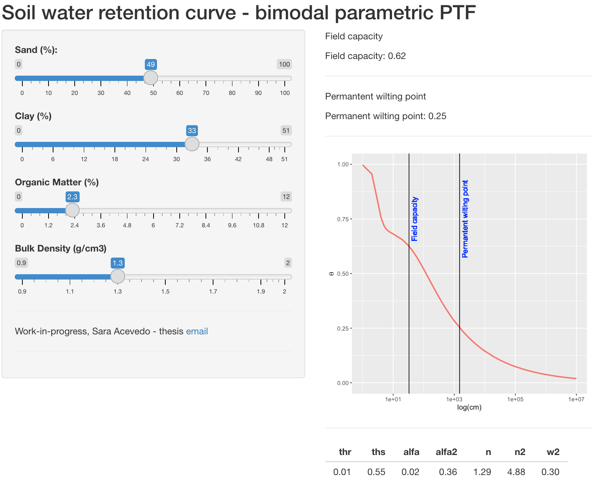

## :computer: Work-in-progress :computer:

### Bimodal PTF for estimation of SWRC.



### For running an interactive Shiny app run in your R console:

```R
# Install the following packages:
install.packages("shiny")
install.packages("devtools")
install.packages("tidymodels")
install.packages("ranger")

# Easiest way is to use runGitHub() function
shiny::runGitHub("shinyapp_bimodal", "Saryace")

# Also, you can run the tar or zip directly
shiny::runUrl("https://github.com/Saryace/shinyapp_bimodal/archive/master.tar.gz")
shiny::runUrl("https://github.com/Saryace/shinyapp_bimodal/archive/master.zip")
```

* Colaboration? Comments? suggestions are welcome at seaceved@uc.cl.


